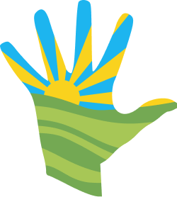

# Brand DNA: Meadowbrook & The DRA

## Meadowbrook and the DRA

**Meadowbrook** is the recreational heart of Dartington. The surrounding Dartington estate has a proud history of creativity, ecology and alternative thinking - Meadowbrook is where you come to let your hair down, relax, and be social.
Our place for sport and play.

The physical site, Bequeathed to the community by the Dartington Hall Trust, has some recognisable features that we reference in our branding:

- Its **wooden 1960s community building**, built by the local community using salvaged telegraph poles with a nod to the Californian style - formally red wood cladding but now painted dark grey and bright white window frames
- The verdant **mounds of grass** created when the community dug the swimming pool
- The **outdoor swimming pool** - currently closed, with strong community support behind its restoration
- The kids' **playground** with swings, zip line, roundabout and climbing frame
- A popular **bar and pizza restaurant**, creating a nightlife venue as well as a place to enjoy the sun with friends
- Cross the bridge over the brook to **playing fields, bike track and nature trails**

The DRA is the charity that manages Meadowbrook. Its identity should feel like the responsible, community-minded organisation behind the place - warm and accessible.

The DRA logo - the "hand"  - is bright, sunny, optimistic and accessible. Is referenced when talking about Meadowbrook but is the DRA logotype. Meadowbrook is what people know and recognise. The DRA are the people that make it work.

The predominant way to create a recognisable Meadowbrook identity is through photography. The design system should act as a **chameleon** - stepping back to let the facilities and their sub-brands be the stars, while maintaining a cohesive overall feel.

---

### Core Colour - from the physical setting

The Meadowbrook palette is drawn from the landscape itself - warm, natural, and unassuming. It provides the canvas that zone colours sit on top of.

Backgrounds and bases: a warm, papery palette, hints of sandy stone. #FBF0DF with blocks of #D1B08B and whites. Organic and natural slightly nostalgic.

Green: #74A953 and #A7C756 from the logo but also representing the grassy mounds. Fresh.

Bright: Strong warm yellow, evocative of sunshine #F9D21E and bright blue sky #1DB5EF together: bold, primary, and punchy.

At night: #3C3C3A and #A73916 with white. Referencing the building colour.

### Core Typography

Each zone will have its own headline font, but all the core Meadowbrook font is **Plus Jakarta Sans**, used in body and headline.

**Typeface:** Plus Jakarta Sans

| Role | Size | Weight | Notes |
|---|---|---|---|
| Display | 3.5rem / 2.75rem | Bold | Letter spacing `-0.02em`. Billboard moments. |
| Headline | 2rem / 1.75rem | Medium | Section starts |
| Body | 1rem / 0.875rem | Regular | Line height `1.6` for readability |
| Label | 0.75rem / 0.6875rem | Medium | All-caps, tracking `0.05em`. Eyebrows and chips. |

Pair a Display headline with a Label eyebrow for a magazine-style layout.

### Core design principles

#### No borders
Avoid 1px solid borders to define sections. Use background shifts and tonal transitions instead - this creates a seamless, high-quality feel that doesn't compete with photography.

#### Tonal layering over shadows
Use surface-level contrast (light vs. slightly lighter) rather than drop shadows. If a floating element genuinely needs separation, use a diffused shadow: `box-shadow: 0 20px 40px rgba(40, 35, 32, 0.06)`.

#### No dividers
Separate content with spacing and background shifts, not lines.

#### Photography
Mood: Candid over posed. Capture people doing things - swimming, eating, laughing, building - not looking at camera. The energy is relaxed participation, not performance.

Light: Favour golden hour and bright overcast. Avoid harsh midday shadows or flat grey skies. If shooting interiors (bar, studio, lounge), lean into the warmth of the existing lighting rather than correcting it to neutral.

Colour grading: Warm highlights, slightly lifted shadows. Think "sunny afternoon" not "Instagram filter." Greens should feel lush and true, not teal-shifted. Skin tones stay natural - never orange, never desaturated.

People: Always with consent. Show the range of who actually uses the space - families, teenagers, older regulars, solo visitors. Groups of 2–5 feel more intimate and real than crowd shots. Include hands doing things (pulling pints, chalking cues, planting).

Place without people: When shooting the site empty, shoot it as if someone just left or is about to arrive - a half-finished drink, an open gate, towels on the grass. Avoid the "closed for business" feel.

What to avoid:

Drone/aerial shots as a default (save for the map and rare context)
Over-saturated or HDR processing
Anything that makes the space look bigger or shinier than it is - honesty is part of the brand
Stock photography or AI-generated imagery

Framing: Mix close-up detail (texture of the building cladding, water rippling, pizza dough stretching) with mid-range activity shots. Full wide establishing shots are useful but shouldn't dominate - they flatten the sense of intimacy.

#### Map
A key asset is the [map of our site](images/map.png).

### Voice and tone
- **Warm and direct.** Write as a neighbour or friend, not a corporation.
- **Community-first.** "We" and "us" refer to the whole community, not just the DRA staff. Second person ("you", "your") is used to address the reader.
- **Optimistic but grounded.** Meadowbrook has rough edges - a pool that needs restoring, a community building that's seen better days. Copy acknowledges this without apologising for it.
- **Short.** Headlines are punchy - often just 2–4 words. Body copy gets to the point fast.
- **Sentence case throughout** - never title case in body or UI. Zone and facility names are proper nouns; everything else is lowercase.
- **No emoji** in formal materials. Informal social posts may use them sparingly.

#### Examples
- ✅ "Come as you are."
- ✅ "The pool is closed for now. Help us bring it back."
- ✅ "A place to swim, kick around, eat pizza and stay too late."
- ❌ "Experience World-Class Recreation At Dartington!"
- ❌ "🏊 Splash Zone Active 🏊"

#### Casing
- UI labels: sentence case (`Book a table`, not `Book A Table`)
- Zone names: proper nouns (`Outdoor Pool`, `The Building`)
- Buttons: sentence case (`Find out more`)
- Navigation: sentence case

---

## Recreation zones

The core meadowbrook brand falls away when we focus on a specific zone. We use zone heading fonts, and colours without re-building the whole brand, layout /design principles.

### Extravaganza and events
Music, events, food, and community celebrations. Village fete energy - handmade, joyful, and participatory.

The core Meadowbrook palette amplified: lead with warm yellow and green, bring in the warm red as a festive accent. Feels rooted in Meadowbrook but has a sense of occasion.

#F9D21E, #74A953, #A73916 accent, #FFFFFF.
Heading font: **Abril Fatface** https://fonts.google.com/specimen/Abril+Fatface

### Dartington Pool
Outdoor Pool background: #20B9DB. Mosaic tiles: #45BFDF #A0D8EA #6DC8E4 #9CD6E9
Mosaic tiles, Water reflections.
Heading font: **Rextron** https://fontlot.com/rexton-font/ #000

### Snooker Room
#004D26
#181C1B
#FFFFFF
Dark green baize, warm snooker lighting. Reference snooker ball colours as required.
Heading font: **Billiards** https://www.dafont.com/billiards.font

### Scuba Diving Club 
Nautical - navy, white, blue-grey equipment 
#0490A4 
https://totnes-bsac.link 

### Playing Fields
White line markings and goalposts
#228B22 #FFFFFF
Heading font: **Oswald** bold https://fonts.google.com/specimen/Oswald

### Playground
Reference the blue and yellow from the hand logo, in moderation.
#FFA500 and #FF4500
Heading font: **Nunito** https://fonts.google.com/specimen/Nunito

### The DRA
When talking specifically about the charity, the DRA (Dartington Recreation Association). DRA in headline font, "Dartington Recreation Association" in body font.
Heading font: **Lobster** https://fonts.google.com/specimen/Lobster

### Bike Track
#F04E23 background + block colour
#000 Bold black headline text. Alignment ranged.
Heading font: **Bebas Neue** https://fonts.google.com/specimen/Bebas+Neue?preview.script=Latn

### Studio
Used for Martial Arts & Yoga and occasional events/parties.
#8B4513 References Parquet floor, wheat walls #F5DEB3, accents #D2691E
Heading font: **Josefin Sans** https://fonts.google.com/specimen/Josefin+Sans?preview.script=Latn

### Lounge
#401D00 with #EEC776
Heading font: **Righteous** https://fonts.google.com/specimen/Righteous?preview.script=Latn&query=Righteous

### Sauna
Cedar benches and walls. Elemental warmth and cold.
#A0522D

### Energy Hub
A community electricity project in collaboration with local schools to create a microgrid of clean green energy for local use.
Colour and font to be determined (or using core).

### Co-working & Community Room
Coming soon. Light wood, white walls, local artwork.

### Bar and Music Evening 
Nightlife vibes, hospitality. Social, Music. In most cases we will link out to the organisations that represent this space, but use #1A1A1A when needed: https://thingshappenhere.co.uk and https://pizzalogica.uk